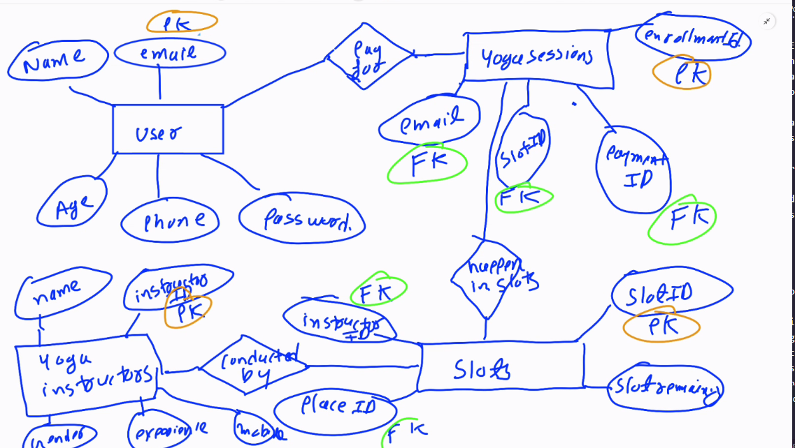
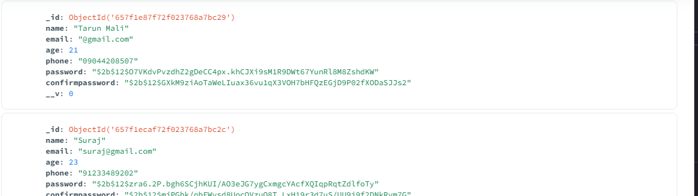
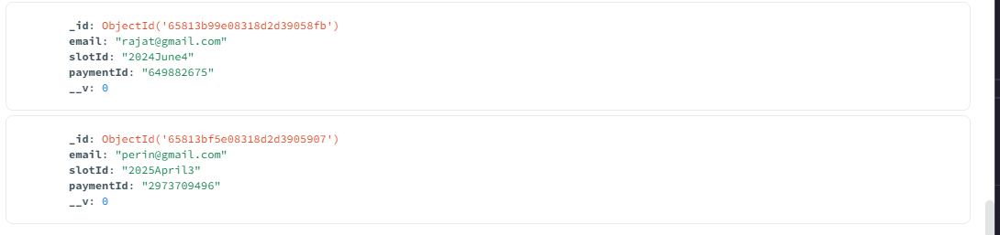
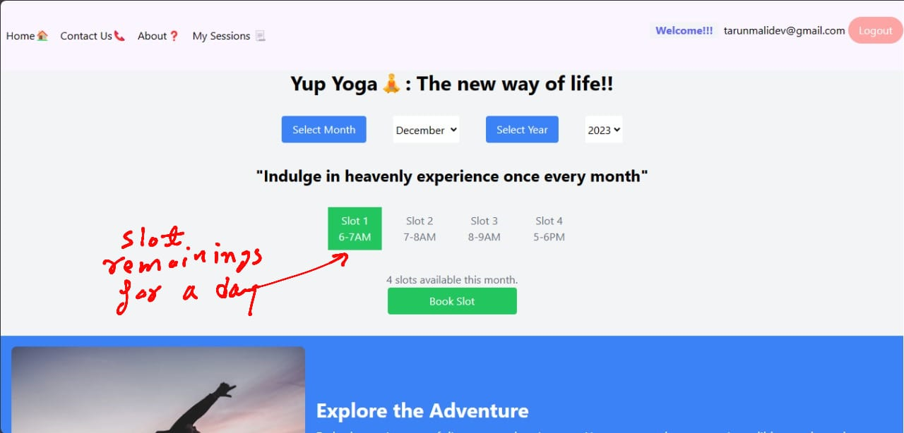
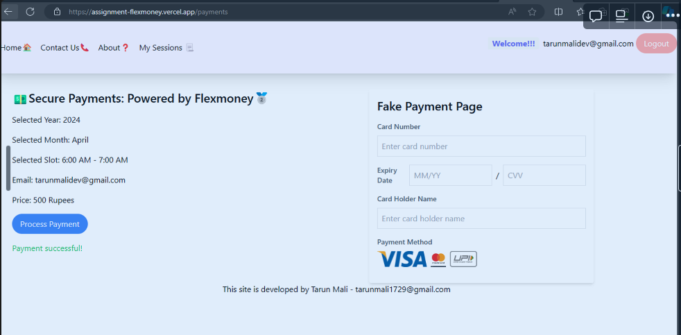
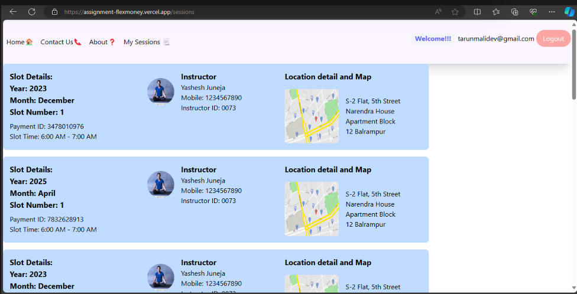

# flexmoney_submission


## Watch demo video
[](https://www.youtube.com/watch?v=uc_ZqWY1o4g)


## Database
### Proposed tables

#### USER_INFO


```
CREATE TABLE `USER_INFO` (
	`Email` VARCHAR(),
	`Name` VARCHAR(),
	`Age` INT(),
	`Phone` VARCHAR(),
	`Password` VARCHAR(),
	PRIMARY KEY (`Email`)
);
```

#### Enrollments


#### SLOT_DETAILS


#### PAYMENT_DETAILS
 

#### INSTRUCTORS_DETAILS


#### PLACE_DETAILS


### ER diagram
#### Part 1



### Actual tables
These are the acutual tables on mongoDB which the service is using right now

#### User collection


#### Enrollments collection



## Code infrastructre and tools

### Containerisation

## Code logic and Algorithms 


## Assumptions
1. There are infinite slots of every type availabele every day. (This a proposed future feature where it shows the available slots every day on the dashboard similar to cowin app)


### Proposed approach for this feature
The slot indicator will be a made a react component, and to show some special things like slot filling fast, less slots we can use higher order components


## Improvements Possible
### Features

1. Number of  Slots remaining on each unique slot (kind of like cowin ). At present I have infinite slots of each Yoga session
2. Building an admin panel, the admin can allocate teachers, timing ,address and no. of available slots to the Yoga session. At present I am using static data. Building SLOT_DETAILS table {slotID, slotRemaining, instructorId, placeId}  (collection as I am using mongoDB)  . Admin can also manage instructors details by INSTRUCTOR_DETAILS table
3. If real payment was used, a PAYMENT_DETAILS table with paymentID as primary key, (storing all the banking details) at present I am using a ENROLLMENT_DETAILS and storing {email,slotID,paymentID}. The paymentID I am storing right now is randomly generated.
4. Sending email to the users when the payment is completed and sending confirmation with all the details and a print to pdf button when payment is completed.
5. Freezing the user from booking another slot on the same day if he had booked one today
6. Option to edit  (prepone/postpone) and cancel the session. 
7. Ability to add automatic recurring sessions with auto payment

### Frontend features:

1. Password strength checker bar
2. Make website responsive for mobile phones (not responsive as of now)
3. A dedicated about page on Yoga and using Chunking/lazy loading on it as few people will be going to open the page
4. Building custom hooks for repeating actions
5. Animated loading spinners instead of static Loading screen
6. Full page green color confirmation pop on competing the payment instead of green text



7. Arranging the slot details in increasing order of month. At present they are arranged by date of creation.



8. Using browserlist to make sure the website run on all websites
9. Night mode

### CI/CD pipeline

1. Right now I am using docker to containerize my node.js backend, uploading it to Amazon ECR **registry** and running on Amazon App runner.  have to manually dockerize the node.js backend , manually upload it to Amazon ECR registry after every feature release. I plan to automate this stuff.
2. Containerizing the react frontend, right now deployed on Vercel
3. Using Kubernetes along with docker to fine tune the scaling of my node.js app according to traffic