# flexmoney_submission


## Watch demo video
[](https://www.youtube.com/watch?v=uc_ZqWY1o4g)


## Database
### Proposed tables

#### USER_INFO


```
CREATE TABLE `USER_INFO` (
	`Email` VARCHAR(),
	`Name` VARCHAR(),
	`Age` INT(),
	`Phone` VARCHAR(),
	`Password` VARCHAR(),
	PRIMARY KEY (`Email`)
);
```

#### Enrollments


#### SLOT_DETAILS


#### PAYMENT_DETAILS
 

#### INSTRUCTORS_DETAILS


#### PLACE_DETAILS


### ER diagram
Complete digital handrawn er diagram uploades as a pdf

#### Part 1


#### Part 2
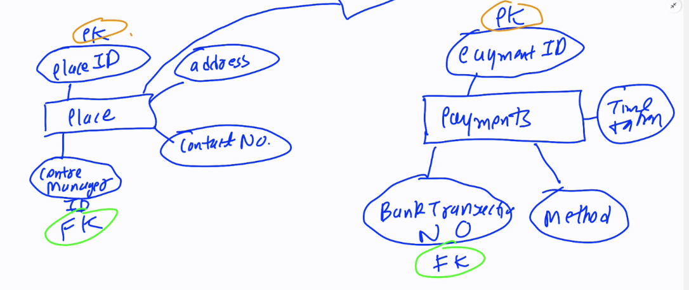

### Actual tables
These are the acutual tables on mongoDB which the service is using right now

#### User collection
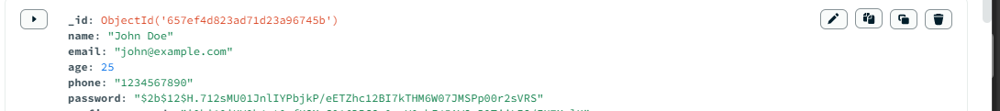

#### Enrollments collection


## Code infrastructre, Tech stack and tools
1. Frontened is written in React with Parcel being the bundler. TailwindCSS is used to style the page.
2. Backend is in Express(Node.JS).
3. Frontend is deploed on Vercel.
4. The Node.JS backend is containerized by Docker, app image is first uploaded on Amazon App ECR registry and then deployed on Amazone App runner 
5. MongoDB is used for the Database


## Assumptions
1. There are infinite slots of every type availabele every day. (This a proposed future feature where it shows the available slots every day on the dashboard similar to cowin app)


### Proposed approach for this feature
The slot indicator will be a made a react component, and to show some special things like slot filling fast, less slots we can use higher order components


## Improvements Possible
### Features

1. Number of  Slots remaining on each unique slot (kind of like cowin ). At present I have infinite slots of each Yoga session
2. Building an admin panel, the admin can allocate teachers, timing ,address and no. of available slots to the Yoga session. At present I am using static data. Building SLOT_DETAILS table {slotID, slotRemaining, instructorId, placeId}  (collection as I am using mongoDB)  . Admin can also manage instructors details by INSTRUCTOR_DETAILS table
3. If real payment was used, a PAYMENT_DETAILS table with paymentID as primary key, (storing all the banking details) at present I am using a ENROLLMENT_DETAILS and storing {email,slotID,paymentID}. The paymentID I am storing right now is randomly generated.
4. Sending email to the users when the payment is completed and sending confirmation with all the details and a print to pdf button when payment is completed.
5. Freezing the user from booking another slot on the same day if he had booked one today
6. Option to edit  (prepone/postpone) and cancel the session. 
7. Ability to add automatic recurring sessions with auto payment

### Frontend features:

1. Password strength checker bar
2. Make website responsive for mobile phones (not responsive as of now)
3. A dedicated about page on Yoga and using Chunking/lazy loading on it as few people will be going to open the page
4. Building custom hooks for repeating actions
5. Animated loading spinners instead of static Loading screen
6. Full page green color confirmation pop on competing the payment instead of green text


7. Arranging the slot details in increasing order of month. At present they are arranged by date of creation.


8. Using browserlist to make sure the website run on all websites
9. Night mode

### CI/CD pipeline

1. Right now I am using docker to containerize my node.js backend, uploading it to Amazon ECR **registry** and running on Amazon App runner.  have to manually dockerize the node.js backend , manually upload it to Amazon ECR registry after every feature release. I plan to automate this stuff.
2. Containerizing the react frontend, right now deployed on Vercel
3. Using Kubernetes along with docker to fine tune the scaling of my node.js app according to traffic

## Code logic and Algorithms  (along with step wise screenshots)
1. Landing page
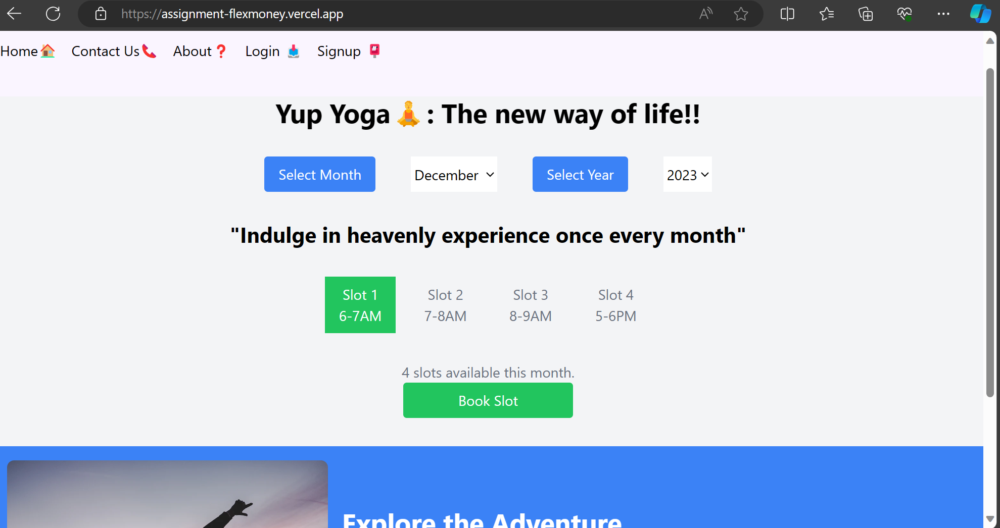
Users can see available slots without logging in, but cannot book without login

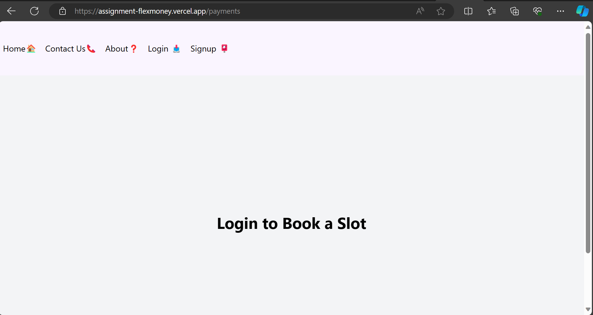

2. Signup

Data validation is done on the fly in frontend

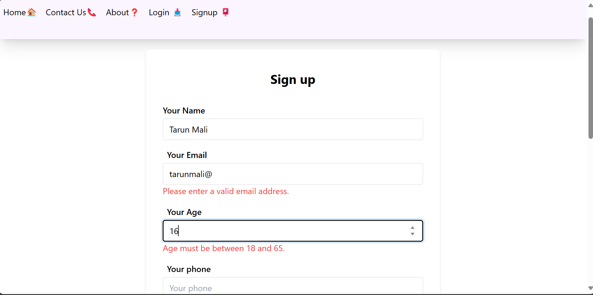
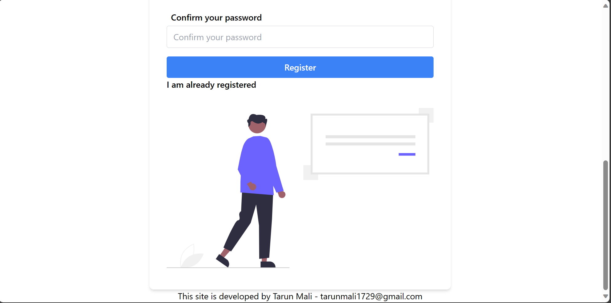

When user signup for the first time, they are wecomed by confetti made possible by canvas-confetti npm package

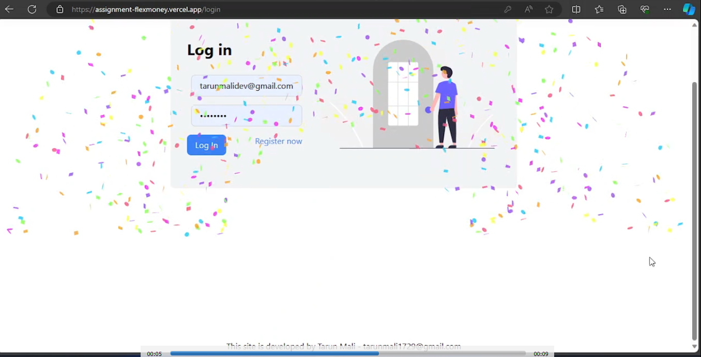

```
confetti({
particleCount: 600,
spread: 180,
});
```

The passwords are hashed by bcrypt before storing to the MongoDB database
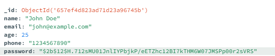

3. Login
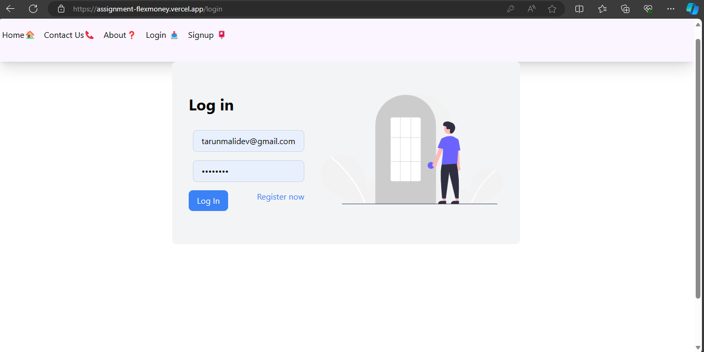

Screen after login
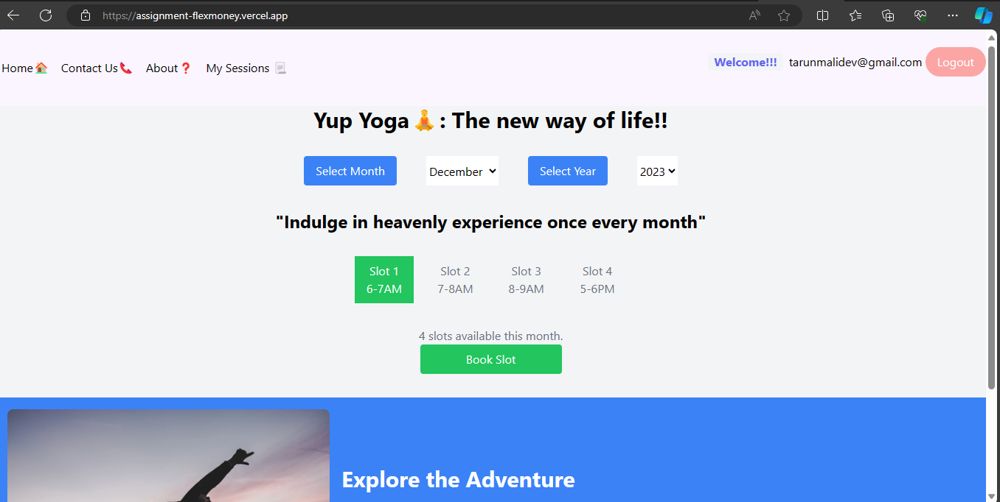

Using Context API, saving the access token. Also saving it in session storage
```
setAccessToken(data1.accessToken);
sessionStorage.setItem("accessToken", data1.accessToken);
```

4. Payment
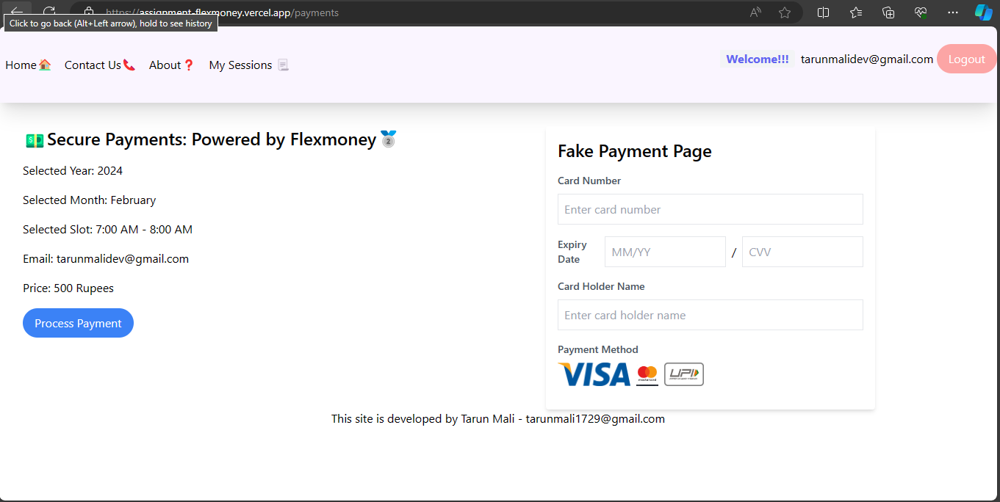

When Process payment is done, in the backend actually we are saving that particular session in database. No actual payment is being done, also there is a Fake payment page.

We are saving the data in Enrollments MongoDB collection
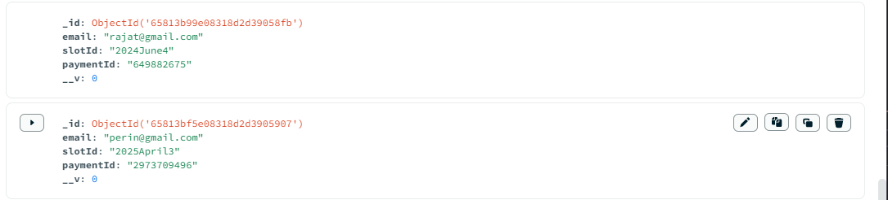

We are storing email of the logged in user, slotID which is made up of Year+ Month + slot number and a fake paymentId which is randomly generated

5. View sessions

The Instructor and location detail is right now static

6. Logout
```
sessionStorage.removeItem("accessToken");
setAccessToken(null);
```


## Containerization and deploying in detail

Although I have heard a lot about docker and containerisation, this was my first time using it in production. After dockerisation, I have took help of these two articles to deploy the image on cloud

1. Uploading the image to Amazon ECR registry
https://www.freecodecamp.org/news/build-and-push-docker-images-to-aws-ecr/

2. Using Amazon App runner to deploy the containerized image
https://nathanpeck.com/your-first-nodejs-container-on-aws/
